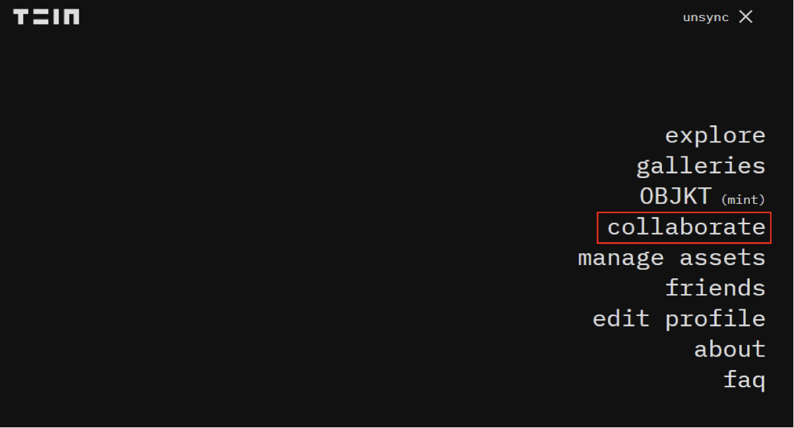
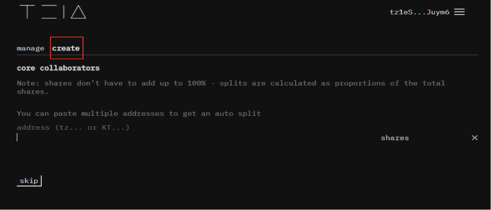
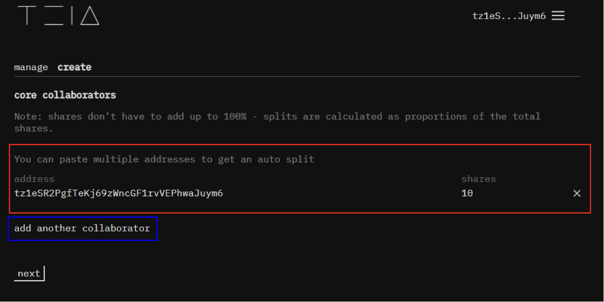
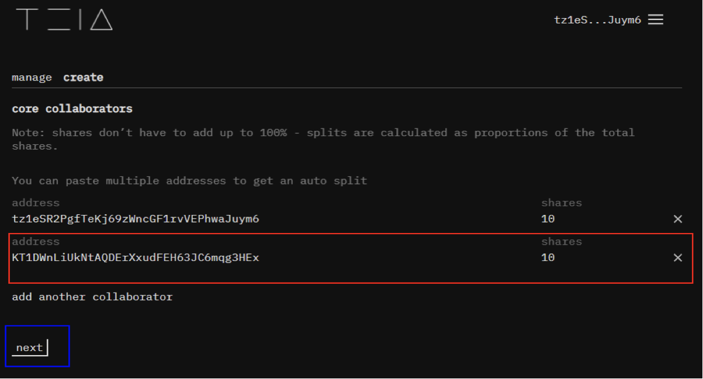
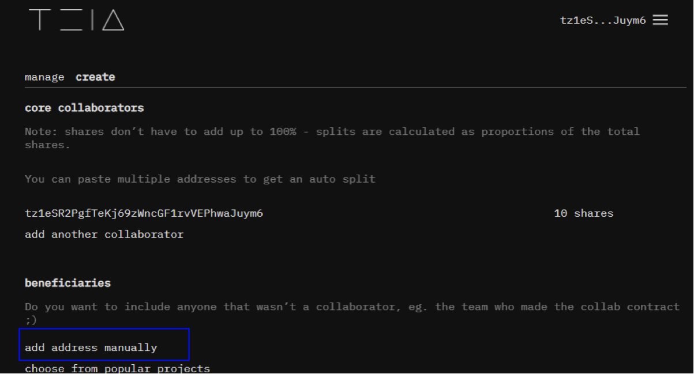
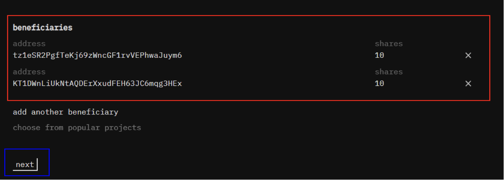
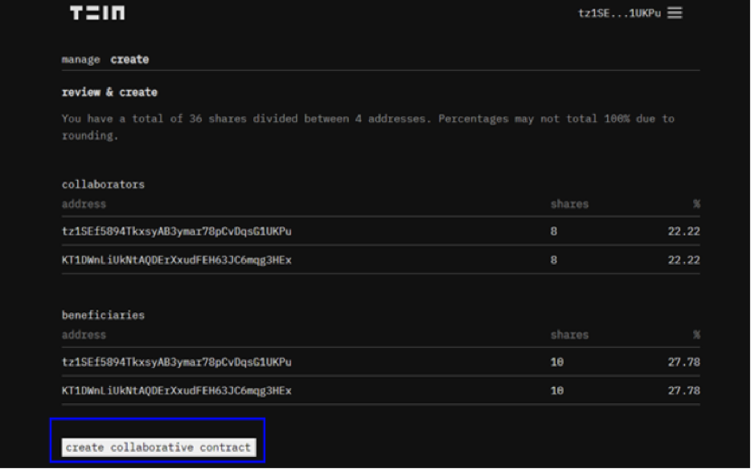
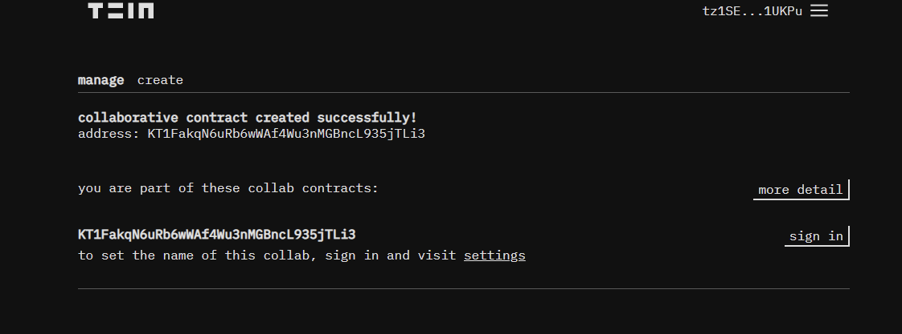

# Ukraine Fundraiser

In support for our Ukrainian friends, brothers and sisters, [Veqtor](https://twitter.com/Veqtor/status/1497167740146266112?s=20&t=mmvu8KPxybOa0TQXX32nFw) from [Versum](https://twitter.com/versumofficial) and [FxHash](https://twitter.com/fx_hash_/status/1497113572085751810?s=20&t=mmvu8KPxybOa0TQXX32nFw) set up a shared donation contract that will redirect tezos to multiple charity orgs (listed below) in support of Ukraine relief, and we want to help support this initiative.

If you wish to donate, send tezos (no direct NFT donations please, only tezos) or set up a collab contract on [teia.art](https://teia.art/) to direct % of the fees to this fundraiser address (see how to below):

`KT1DWnLiUkNtAQDErXxudFEH63JC6mqg3HEx`

## Supported Organisations

The currently supported organisations with this contract are: 

[save the children](https://thegivingblock.com/donate/save-the-children/)

[international medical corps](https://thegivingblock.com/donate/international-medical-corps/)

[direct relief](https://thegivingblock.com/donate/direct-relief/)

[CARE](https://thegivingblock.com/donate/care/)

[project HOPE](https://thegivingblock.com/donate/project-hope/)

[CPJ](https://thegivingblock.com/donate/committee-to-protect-journalists/)

[OutRight Action International](https://thegivingblock.com/donate/outright-action-international/) 

The organisations chosen are all non-militarian: Medical, aid, journalism, etc. and the List can be changed later if certain organisations are found to be problematic.

## How to set up a Contract for directing sales to the initiative contract

This is the steps to allocate a percentage of your artwork sales to be donated to the donation contract setup by Versum Team & fxhash in Teia platform (Note: using this method is subject to 25-27% baking fee)

You don’t need to add the Ukraine Contract `KT1DWnLiUkNtAQDErXxudFEH63JC6mqg3HEx` as a collaborator, only as a beneficiary. 

First click on the menu button & click on the **collaborate** option:

Click on create and the below fields should show up:

Enter your address first with the number of shares as 10 and then an option for another collaborator will show up and click on:

Once another collaborator field shows up add the Contract Address `KT1DWnLiUkNtAQDErXxudFEH63JC6mqg3HEx` to the second field and enter the shares as well as 10

Once you have made sure the address is enter correctly click on next:

In this stage click on add address manually:

Add both address to beneficiaries as done before and then click next:

Should look something like this example below

Click on `create collaborative contract` button and confirm on your wallet:

At the end `manage` tab should show your collab contract:

If you want 100% of the proceeds to go to Ukraine set your share as a collaborator as 1 and the Ukraine Contract `KT1DWnLiUkNtAQDErXxudFEH63JC6mqg3HEx` as 10000 shares.
